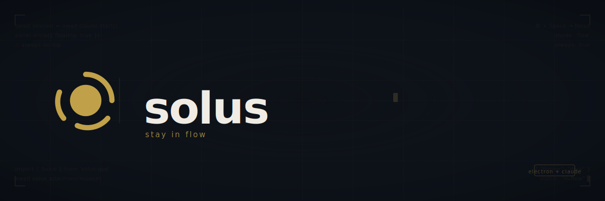

<p align="center">
  
</p>

<p align="center">
  
  
  
</p>

<p align="center">
  A native macOS desktop app that wraps AI coding agents with a beautiful, keyboard-first UI.
</p>

---

## What is Solus?

Solus is an Electron-based macOS app that puts AI coding agents into a polished, floating overlay that lives on top of your workspace. Instead of switching to a terminal, you talk to Claude Code (or Codex) from wherever you are — your IDE, browser, or any other app — and the panel steps out of the way when you don't need it.

## Features

- **Floating overlay** — Glass-morphism panel that sits above all windows with click-through on empty areas
- **Multi-tab sessions** — Run multiple independent agent sessions side by side, each with its own working directory
- **Branch-grouped tabs** — Tabs organized by git branch for managing parallel workstreams
- **Permission modes** — Switch between *Ask*, *Auto*, and *Plan* modes per tab
- **Plan mode** — Agent drafts a plan before executing; annotate it inline before approving
- **Multiple agents** — Switch between Claude Code and Codex per session
- **Architecture diagrams** — Create and edit interactive system diagrams on a live canvas with nodes, edges, and groups
- **Works / Folio** — Agent-created documents, slides, and diagrams saved as standalone artifacts you can export or continue editing
- **Split pane layout** — View artifacts and conversation side by side
- **Diff panel** — Rich diff view with per-turn navigation, file tree, and inline commenting
- **Scratchpad** — Project-scoped scratch notes panel that persists across sessions
- **Git worktree mode** — Run agents on isolated git branches without disturbing your working tree
- **Voice input** — Dictate prompts using local Whisper transcription with voice-activity detection
- **Design annotation mode** — Annotate screenshots with shapes, arrows, and text before sending
- **File & screenshot attachments** — Attach files or snap a screenshot directly from the input bar
- **Skills** — Slash-command skill registry with fuzzy search
- **Session history** — Resume and pin previous sessions from within the app
- **Model picker** — Switch between Claude models per tab
- **Light / dark theme** — Follows macOS system appearance

## Requirements

- macOS
- [Bun](https://bun.sh)
- Xcode Command Line Tools
- [Claude Code](https://github.com/anthropics/claude-code) CLI installed and authenticated
- [Codex](https://github.com/openai/codex) CLI (optional, for Codex agent support)

## Getting Started

```bash
# Install dependencies
bun install

# Optional: create local config for analytics, Google integration, or release signing
cp .env.example .env

# Run in development
bun run dev

# Verify the app and web client build
bun run build

# Build for production
bun run dist
```

After `dist` completes, a `Solus.app` bundle will be placed in the `dist` folder. Drag it to `/Applications`.

Local environment values are optional for normal development. Leave analytics and Google OAuth variables empty unless you are testing those integrations. Release signing variables are only needed for signed and notarized macOS builds.

## Server

Solus also ships as a standalone, headless server (for Linux hosts or running Solus outside the macOS app) that serves the web client and speaks the same RPC protocol as the desktop app.

### Build and package locally

```bash
# Build the app + web client (produces dist/main/standalone.js and dist/client)
bun run build

# Package the server for your current platform/arch
bun scripts/package-server.ts

# Or target a specific platform/arch (used by CI for releases)
bun scripts/package-server.ts --platform linux --arch x64
```

This produces `release/solus-server-<platform>-<arch>.tar.gz` — a self-contained bundle with a pinned Node runtime, the bundled server, the CLI, and the web client. Supported targets: `darwin-arm64`, `linux-x64`, `linux-arm64`.

### Test the packaged server before release

```bash
# Extract the tarball somewhere and run it
mkdir -p /tmp/solus-server && tar -xzf release/solus-server-<platform>-<arch>.tar.gz -C /tmp/solus-server

# Start it in the foreground (prints the reachable URL and claim code)
/tmp/solus-server/bin/solus start

# Or manage it as a background daemon
/tmp/solus-server/bin/solus start --daemon
/tmp/solus-server/bin/solus status
/tmp/solus-server/bin/solus logs
/tmp/solus-server/bin/solus stop
```

Useful flags/env vars: `--data-dir PATH` (or `SOLUS_DATA_DIR`), `--host HOST` (or `SOLUS_HOST`), `--port PORT` (or `SOLUS_PORT`).

To iterate on server code without repackaging the tarball each time, just re-run `bun run build` then `bin/solus-server` directly from a previously packaged bundle, or run `bun run dev` and connect the web client (`client/`) against the dev server.

## Keyboard Shortcuts

### System-wide (work even when Solus is hidden)

| Shortcut | Action |
|---|---|
| `⌥Space` | Toggle window |
| `⌘⇧K` | Toggle window (alternative) |

### General

| Shortcut | Action |
|---|---|
| `⌥⇧,` | Open settings |
| `⌥L` | Focus input |
| `⌥⇧Q` | Toggle quick actions |
| `` ⌥⇧` `` | Open terminal |
| `⌥⇧/` | Show keyboard shortcuts |

### Tabs

| Shortcut | Action |
|---|---|
| `⌥⇧T` | New tab |
| `⌥F` | Fork session |
| `⌥⇧W` | Close tab |
| `⌥⇧→` | Next branch / tab |
| `⌥⇧←` | Previous branch / tab |
| `⌥⇧N` | Next session in branch |
| `⌥⇧P` | Previous session in branch |
| `⌥⇧U` | Group tabs by status |

### View

| Shortcut | Action |
|---|---|
| `⌥⇧E` | Toggle editor / pill mode |
| `⌥⇧D` | Toggle diff panel |
| `⌥⇧\` | Open artifact in split pane |
| `⌥M` | Toggle project panel |
| `⌥⇧L` | Open plans gallery |
| `⌥⇧;` | Open folio gallery |
| `⌥B` | Toggle sidebar |
| `⌥⇧=` | Expand / collapse input |

### Compose

| Shortcut | Action |
|---|---|
| `⌥⇧O` | Select project |
| `⌥⇧A` | Attach file |
| `⌥⇧S` | Take screenshot |
| `⌥⇧I` | Design annotation mode |

### Agent

| Shortcut | Action |
|---|---|
| `⌥⇧Tab` | Cycle permission mode (Ask → Auto → Plan) |
| `⌥⇧M` | Cycle model |
| `⌥⇧G` | Cycle agent |
| `⌥⇧Z` | Toggle reasoning menu |

### Conversation

| Shortcut | Action |
|---|---|
| `⌥H` | Scroll to top |
| `⌥⇧F` | Open all changed files in editor |
| `^C` | Stop agent |

### Navigation

| Shortcut | Action |
|---|---|
| `⌥⇧R` / `⌥⇧J` | Toggle session history picker |

### Voice

| Shortcut | Action |
|---|---|
| `⌥⇧V` | Toggle voice mode |
| `⌥⇧K` | Toggle mic recording |

### Git

| Shortcut | Action |
|---|---|
| `⌥⇧B` | Toggle worktree mode |
| `⌥⇧H` | Switch worktree |
| `⌥⇧Y` | Open worktree in terminal |
| `⌥⇧C` | Commit and push |
| `⌥⇧.` | Sync (pull) |

### Session

| Shortcut | Action |
|---|---|
| `⌥⇧X` | Pin / unpin session |

### Diff Panel

| Shortcut | Action |
|---|---|
| `Escape` | Close panel |
| `⌥M` | Maximize / restore |
| `⌥R` | Refresh diff |
| `⌥N` | Next file |
| `⌥P` | Previous file |
| `⌥F` | Search files |
| `⌥T` | Toggle file tree |
| `⌥]` | Next comment |
| `⌥[` | Previous comment |
| `⌥→` | Next turn |
| `⌥←` | Previous turn |
| `⌥V` | Toggle split / unified view |
| `⌥C` | Start comment |
| `⌥↩` | Send to session |

### Plan Gallery

| Shortcut | Action |
|---|---|
| `Escape` | Close |
| `/` | Focus search |
| `↩` | Open plan |
| `⇧↩` | Resume session |
| `→` / `←` / `↑` / `↓` | Navigate grid |
| `⌥B` | Toggle bookmark |

### Plan Review

| Shortcut | Action |
|---|---|
| `⌥Y` | Approve (ask mode) |
| `⌥A` | Approve (auto mode) |
| `⌥R` | Reject |
| `⌥V` | Reject with feedback |
| `⌥L` | Focus comment field |
| `⌥W` | Toggle worktree |

### Plan Modal

| Shortcut | Action |
|---|---|
| `Escape` | Close |
| `⌘M` | Comment on selection |
| `⌥S` | Save |
| `⌥C` | Copy to clipboard |
| `⌥B` | Toggle bookmark |
| `⌥M` | Toggle comments |
| `⌥O` | Resume session |
| `⌥G` | Open in Google Docs |
| `⌥⇧T` | New tab |

### Document Modal

| Shortcut | Action |
|---|---|
| `Escape` | Close |
| `⌥S` | Save |
| `⌥C` | Copy to clipboard |
| `⌥G` | Open in Google Docs |

### Folio Gallery

| Shortcut | Action |
|---|---|
| `Escape` | Close |
| `/` | Focus search |
| `↩` | Open document |
| `↑` / `↓` | Navigate |
| `⌥⌫` | Delete document |

### Design Annotation

| Shortcut | Action |
|---|---|
| `Escape` | Cancel / dismiss |
| `⌘↩` | Confirm |
| `⌘Z` | Undo |
| `⌘⇧Z` | Redo |
| `1` | Rectangle tool |
| `2` | Arrow tool |
| `3` | Pin tool |
| `4` | Text tool |
| `5` | Eraser tool |

### Diagram Canvas

| Shortcut | Action |
|---|---|
| `⌘A` | Select all |
| `⌘C` | Copy selection |
| `⌘V` | Paste |
| `⌘D` | Duplicate selection |
| `Delete` | Delete selection |
| `⌥N` | Add node |
| `⌥G` | Add group |
| `⌘F` | Search nodes |
| `Escape` | Close search / drawer / focus |
| `PgUp` / `PgDn` | Zoom in / out |
| `↑` / `↓` / `←` / `→` | Nudge (10px) |
| `⇧↑` / `⇧↓` / `⇧←` / `⇧→` | Nudge (1px) |

## Tech Stack

- **Electron** + **electron-vite** — app shell and build pipeline
- **Svelte 5** + **TypeScript** — UI
- **Tailwind CSS v4** — styling
- **@anthropic-ai/claude-agent-sdk** — Claude Code process management

## License

MIT
