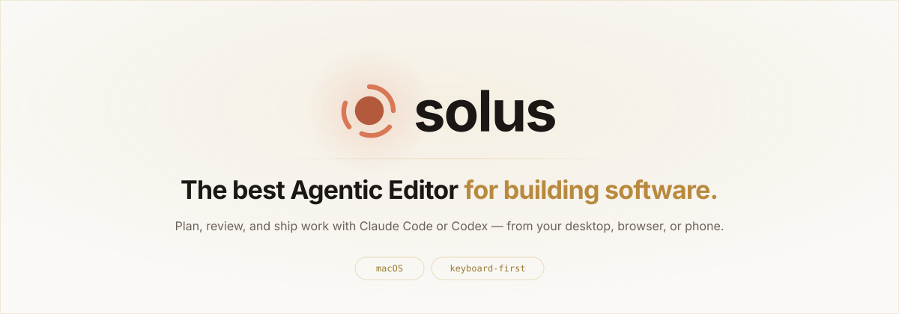

<p align="center">
  
</p>

<p align="center">
  <b>A keyboard-first desktop app for coding agents.</b><br />
  Talk to Claude Code or Codex from a floating overlay that sits above your editor — no terminal tab required.
</p>

<p align="center">
  <a href="https://github.com/Ashton-Sidhu/solus/releases"></a>
  <a href="https://solus.sh"></a>
  <a href="./LICENSE"></a>
  <a href="./CONTRIBUTING.md"></a>
</p>

<p align="center">
  <a href="https://solus.sh">Website</a> ·
  <a href="https://solus.sh/docs">Docs</a> ·
  <a href="#install">Install</a> ·
  <a href="https://solus.sh/docs#keybindings">Shortcuts</a> ·
  <a href="./CONTRIBUTING.md">Contributing</a> ·
  <a href="./CHANGELOG.md">Changelog</a>
</p>

---

## Why Solus

Coding agents live in the terminal, and the terminal is a bad place to supervise them. You lose the thread when you switch windows, plans and diffs scroll away, and running two agents at once means juggling panes.

Solus puts agents in a glass overlay that floats above whatever you're doing. Sessions are tabs, plans are reviewable documents, diffs are commentable, and everything has a keybinding. Summon it with `⌥Space`, dismiss it when you're back in flow.

Two layouts, one keystroke apart (`⌥⇧E`): **pill mode** is a compact strip for firing off prompts while you work elsewhere; **editor mode** is a full workspace for reading plans, reviewing diffs, and driving a session with full attention.

## Features

A typical loop: summon Solus, describe the change, review the plan it drafts, watch the diff as it works, send line-level feedback, then commit and merge — without leaving the panel. The features below follow that loop in order, and each links to its section in the [docs](https://solus.sh/docs).

| | |
|---|---|
| [**Sessions & tabs**](https://solus.sh/docs#sessions) | Every tab is an independent session with its own project, agent, model, and permission mode. Fork a conversation to explore two approaches, resume any past session, queue messages while the agent is busy, or isolate risky work on a git worktree. |
| [**Plans**](https://solus.sh/docs#plans) | In Plan mode the agent drafts before it executes. Mark the plan up like a PR — inline comments on any selection — then approve into Ask or Auto mode. Plans are saved to disk with revision history, and work with every model, not just those with native plan support. |
| [**Workspace panes**](https://solus.sh/docs#panes) | Plans, Works, automations, reviews, and diffs open as focused panes or beside the live conversation. Closing a pane restores the chat with scroll position and drafts intact. |
| [**Diff panel**](https://solus.sh/docs#diff) | Every file the agent touched, in a side panel. Step through files, filter by conversation turn, leave line-level comments, and send them back as one structured message. |
| [**Opening changed files**](https://solus.sh/docs#files) | Jump from any inline diff preview straight into VS Code, vim, nvim, or helix — or open every file changed in the session at once. |
| [**Review companion**](https://solus.sh/docs#review) | A second agent reviews your branch — commits, uncommitted edits, and untracked files — and writes a report of grouped findings. Click a finding to land on that exact hunk. |
| [**Pull requests**](https://solus.sh/docs#pull-request-merge) | Merge, squash, or rebase a PR from its review surface, with status, checks, and unresolved conversations in view. Conflicted PRs can be handed to an agent in an isolated worktree. |
| [**Works**](https://solus.sh/docs#works) | Docs, slides, and diagrams the agent produces are extracted from the chat and saved as standalone artifacts you can search, edit, and export — they outlive the session that made them. |
| [**Document editor**](https://solus.sh/docs#document-editor) | Native Markdown editing with a selection toolbar, slash commands for block types, and bidirectional raw-Markdown sync. |
| [**Design mode**](https://solus.sh/docs#design-mode) | Screenshot any window, annotate it with rectangles, arrows, numbered pins, and text, and send the composited image to the agent. |
| [**Voice input**](https://solus.sh/docs#voice) | Push-to-talk or a continuous hands-free loop, both transcribed locally with Whisper — audio never leaves your machine. |
| [**Automations**](https://solus.sh/docs#automations) | Save a prompt and run it on a schedule — interval, daily, weekly, monthly, or raw cron — or on demand. Every run keeps a history you can open as a full session. Agents can create automations for you. |
| [**Rate limit queueing**](https://solus.sh/docs#rate-limits) | Hit a limit mid-task and Solus asks, queues and re-sends, continues, or stops — globally or per tab. |
| [**Hosts & connections**](https://solus.sh/docs#connections) | The desktop app doubles as a server: pair your phone or another browser, add other machines as hosts, and choose where each session runs. |
| [**Tasks**](https://solus.sh/docs#tasks) *(soon)* | A project-scoped board of local tickets and GitHub Issues, with sessions started straight from a task. |

## Install

**Homebrew** — recommended, and it keeps itself current:

```bash
brew install --cask Ashton-Sidhu/tap/solus
```

**Direct download** — a signed and notarized `.dmg` from [solus.sh](https://solus.sh), or from the [releases page](https://github.com/Ashton-Sidhu/solus/releases). Drag `Solus.app` to `/Applications`. The app updates itself in place from there.

Then press `⌥Space` to summon the window (`⌘⇧K` if that's taken), pick a project with `⌘O`, and start typing.

### Requirements

| | |
|---|---|
| OS | macOS 12 Monterey or later, Apple Silicon |
| Agent | [Claude Code](https://github.com/anthropics/claude-code) CLI, installed and authenticated |
| Optional | [Codex](https://github.com/openai/codex) CLI, for Codex sessions |

Solus drives the agent CLIs you already have installed and auto-detects which are available — it doesn't ship its own agent or ask for an API key.

## Build from source

You'll additionally need [Bun](https://bun.sh) and the Xcode Command Line Tools.

```bash
git clone https://github.com/Ashton-Sidhu/solus.git
cd solus
bun install
bun run dev      # development
```

```bash
bun run build    # verify the app + web client compile
bun run dist     # produces a Solus.app bundle in dist/
```

`.env` is optional — copy `.env.example` if you're testing analytics, Google integration, or release signing. Leave those values empty otherwise.

## Headless server

You don't need the Mac app. Solus ships a standalone server you can run on a home server, a VPS, or any always-on box and drive entirely from the browser — it serves the same web client and speaks the same RPC protocol as the desktop app.

```bash
brew install Ashton-Sidhu/tap/solus-server   # CLI + vendored Node runtime

brew services start solus-server             # run the daemon in the background
solus claim                                  # take ownership from this machine
```

`solus claim` prints a link, a 6-digit code, and a QR — open any of them in a browser to claim the server. After that, [pair devices](https://solus.sh/docs#connections) normally: your phone, a tablet, another laptop.

| Command | |
|---|---|
| `solus start` | Run the server in the foreground (`--host`, `--port`, `--data-dir`) |
| `solus logs` | Tail the daemon log (`--lines N`) |
| `solus claim` | Claim a fresh server |
| `solus update` | Update a tarball install in place (Homebrew installs defer to `brew upgrade`) |

Data lives in `~/.solus`, overridable with `--data-dir` or `SOLUS_DATA_DIR`; `SOLUS_HOST` and `SOLUS_PORT` mirror the flags. The server listens on port 3000 by default.

A running desktop app is itself a server on the same port — so you can reach your Mac's sessions from a browser on your phone without setting any of this up. And once a standalone server is claimed, add it as a **host** in the desktop app to choose, per session, which machine the agent actually runs on.

Not on Homebrew? Each [release](https://github.com/Ashton-Sidhu/solus/releases) attaches a `solus-server-<platform>-<arch>.tar.gz` for `darwin-arm64`, `linux-x64`, and `linux-arm64` — a self-contained bundle with a pinned Node runtime, the server, the CLI, and the web client. Extract it anywhere and run `bin/solus`. To build one yourself:

```bash
bun run build                                              # dist/main/standalone.js + dist/client
bun scripts/package-server.ts                              # package for this platform
bun scripts/package-server.ts --platform linux --arch x64  # or a specific target
```

To iterate on server code without repackaging, re-run `bun run build` and launch `bin/solus-server` from an existing bundle — or run `bun run dev` and point the web client (`client/`) at the dev server.

## Keyboard shortcuts

Global shortcuts use `⌥⇧`, sub-page shortcuts use `⌥`. These are the ones worth learning first — the full reference lives in the [keybindings docs](https://solus.sh/docs#keybindings), or press `⌥⇧/` in the app.

| Shortcut | Action |
|---|---|
| `⌥Space` | Toggle the window (system-wide) |
| `⌥L` | Focus input |
| `⌘O` | Select project |
| `⌘T` | New tab |
| `⌥⇧E` | Toggle editor / pill mode |
| `⌥⇧Tab` | Cycle permission mode (Ask → Auto → Plan) |
| `⌥⇧D` | Toggle diff panel |
| `⌥⇧B` | Toggle worktree mode |

## How it works

```
renderer  →  window.solus.<method>()      (src/preload — wraps as an RPC envelope)
          →  SolusServer.handle()         (src/main/server)
          →  handler in server/handlers/  (one file per domain)
          →  ControlPlane / managers      (src/main/control-plane.ts)
events    ←  broadcast back over RPC topics
```

| Path | Owns |
|---|---|
| `src/main/` | Electron main process — sessions, agents, git, RPC server |
| `src/main/agents/` | Agent backends (`claude/`, `codex/`) and the backend registry |
| `src/renderer/` | Svelte 5 UI — one folder per feature, stores in `contexts/` |
| `src/shared/` | RPC method and topic definitions shared by both sides |
| `client/` | Web client served by the headless server |
| `docs/adr/` | Architecture decision records |

Built with **Electron** + **electron-vite**, **Svelte 5**, **TypeScript**, **Tailwind CSS v4**, and the **@anthropic-ai/claude-agent-sdk**.

## Contributing

Contributions are welcome. Start with [CONTRIBUTING.md](./CONTRIBUTING.md) for setup, code style, and PR expectations; [CLAUDE.md](./CLAUDE.md) documents the conventions agents (and humans) should follow in this repo. Please also read the [Code of Conduct](./CODE_OF_CONDUCT.md).

Found a security issue? See [SECURITY.md](./SECURITY.md) — please don't open a public issue.

## License

[Business Source License 1.1](./LICENSE) — free for personal and internal use; converts to Apache 2.0 on 2030-07-14. You may not resell Solus or offer it as a competing hosted service before then.
