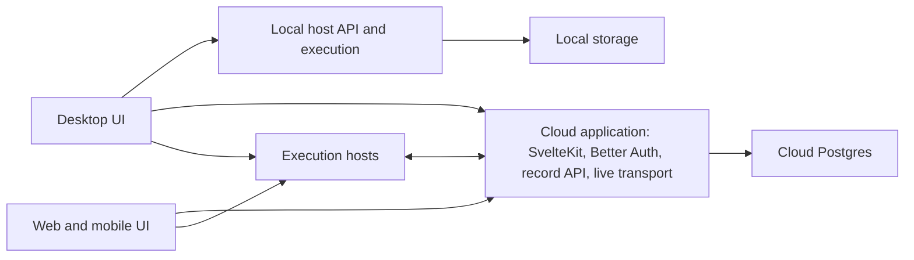

# Plan 013: Deploy Solus Cloud and the record API as one Node application

## Status and execution rules

- **Status:** PLAN — architecture accepted; implementation has not started.
- **Date:** 2026-10-01.
- **Baseline:** Solus `750983cd`; solus-cloud `df66c14`. Solus has substantial uncommitted work, including record operations, Insights, and client changes. That work is part of the baseline and must be preserved.
- **Priority / effort / risk:** P1 / L / high. This changes cloud hosting, authentication hosting, and release composition. It does not change the product's record ownership model.
- **Dependencies:** Current implementations of plans 007–010 and 012; existing API, sharing, live editing, and runner delivery behavior. Read current source rather than assuming old plan status text is current.
- **Repositories:** `/Users/sidhu/solus` and `/Users/sidhu/solus-cloud`.
- **Authorization:** This document records the requested plan. It does not authorize implementation, production deployment, DNS changes, migration of live data, or removal of running services.

Before implementation, read both repositories' operating instructions and codebase maps. Record `git status --short` in each. Compare the scoped source against these baselines:

```sh
# In solus
git diff --stat 750983cd..HEAD -- apps/standalone-server packages/server packages/contracts packages/client-core scripts packaging tests/unit
git diff --stat

# In solus-cloud
git diff --stat df66c14..HEAD -- src worker scripts package.json vite.config.ts .github
git diff --stat
```

Reconcile changes before editing. Do not overwrite another agent's work, reset files, or use git stash. Do not run the Solus build, its build aliases, dev servers, or interactive verification without the permissions required by AGENTS.md. Use focused tests and package checks during implementation. Build and packaged-app gates below belong to CI or an explicitly authorized maintainer run.

## 1. Decision and purpose

Ship one cloud application that combines:

- The SvelteKit website and existing hosted workspace client.
- Better Auth and the existing account, organization, integration, and host-management services.
- The Solus record API and live collaboration transport.
- The existing cloud host-maintenance and usage schedule.

Run this application on Node, initially on the existing Fly hosting platform, with Postgres. Keep the exact Fly application name and DNS cutover in the deployment runbook; do not create infrastructure as part of source implementation.

The desktop and standalone execution host remain separate applications. They retain the same local API capabilities and shared record implementation. Local work does not need Better Auth, an account, or an available cloud service.

The outcome is one tested cloud release, an independent host release, and an independent desktop release. A cloud change must not require rebuilding or updating every installed host.

This replaces the separate account Worker and API deployment as the target architecture. It does not rewrite authentication, move agent execution into the cloud web process, or turn the desktop into a wrapper around a remote website.

## 2. Fixed boundaries

| Application | Contains | Must not contain or require |
| --- | --- | --- |
| Solus Cloud | SvelteKit server, Better Auth, cloud management, record API, live collaboration, cloud maintenance schedule, hosted client assets | Agent processes, user checkouts, local browser execution, Electron |
| Desktop | Shared workspace UI, Electron shell, local host, local records and execution | Better Auth server implementation, cloud account database credentials, imports from solus-cloud |
| Standalone host | Local records, direct pairing, remote client access, provider execution, optional organization attachment | Cloud account server or shared Postgres credentials |
| Shared modules | Contracts, workspace UI, record operations, access rules, storage adapters | A dependency on the private cloud application's entry point or Better Auth configuration |

The dependency direction is **solus-cloud → public Solus packages**. Solus never imports solus-cloud. Keep the repositories separate. Do not create a package per domain or move all existing Data code merely to change deployment composition.



The diagram shows process connections, not a new transport. Preserve existing local IPC and HTTP/WS paths and the client choice of record home and execution host. Shared source is compiled into each application; no local operation becomes a cloud network round trip.

## 3. Current source and constraints

### Cloud website

- `solus-cloud/src/hooks.server.ts` constructs request context and routes `/api/auth/*` to Better Auth. Preserve its CSRF and session checks.
- `src/lib/server/auth/create-auth.ts` contains Better Auth policy and plugins, including organization and OAuth behavior. `auth/index.ts` adds SvelteKit cookie integration and request database access.
- `src/lib/server/runtime.ts` and `db/index.ts` currently use one Postgres connection per request for Workers. `runtime.dispose()` drains response-background work and closes that connection.
- `vite.config.ts` selects the Cloudflare adapter. `worker/index.ts` wraps its output and exports the scheduled handler.
- `src/lib/server/scheduled.ts` runs host maintenance, activity checks, and usage sampling. `wrangler.jsonc` schedules this every five minutes.
- `scripts/sync-client.ts` builds Solus `apps/client`, places assets in `static/`, and moves its document to `src/lib/server/client-shell.html`. The document is outside public assets so sign-in checks execute first.
- `scripts/link-solus.ts` links selected shared packages from the sibling checkout. `.github/workflows/deploy.yml` checks out Solus without a pinned revision.
- `scripts/deploy.ts` applies account migrations before building and deploying the Worker. The new release path must preserve migration ordering while promoting an already tested artifact.

Current authentication dispatch, from `src/hooks.server.ts`:

```ts
const response = authRoute
    ? await auth.handler(event.request)
    : await resolve(event, { /* page transforms */ });
```

Keep this responsibility in the cloud application. Better Auth supplies authentication endpoints and some organization behavior; do not reproduce those endpoints in the shared server package.

### Record API and local host

- `solus/packages/server/src/boot-solus-api.ts` already starts the record service without a `SessionRuntime`, provider backend, automation scheduler, or browser host. It also owns presence, shared prompts, live work rooms, and shutdown subscriptions.
- `apps/standalone-server/src/index.ts` branches on `SOLUS_API=1` before importing host execution boot code. Keep standalone API mode usable for existing self-hosted deployments.
- `packages/server/src/transport/http.ts` builds a Node HTTP server and its request listener. It combines Hono routes, API admission, uploads/assets, and host-specific paths. Engine.IO owns `/ws` requests on that server.
- `transport/solus-api/router.ts` mounts record operations under `/v1`. `data/workspace/service.ts` composes the operations shared by transports and admitted tools.
- `host/solus-api-settings.ts` requires a stable service identity and API signing key. `admission/access-tokens.ts` validates the existing issuer and token audiences.
- `db/database.ts` selects SQLite or Postgres and preserves transaction context and after-commit events. `db/migration-files.ts` currently locates migrations relative to a server bundle.
- `work-live/work-live-manager.ts` keeps rooms, locks, and serialized work operations in memory. `sharing/shared-prompt.ts` keeps live prompt forwarding and receipts in memory. Do not run two independent owners for the same live rooms during rollout.

Current boot contract, from `boot-solus-api.ts`:

```ts
/** Storage/API process. No SessionRuntime, agent backend, automation scheduler, or browser host is constructed. */
export async function bootSolusApi(options: { host?: string; port?: number; staticDir?: string } = {}) {
```

Current shared composition, from `data/workspace/service.ts`:

```ts
/** The same domain operations serve HTTP and admitted agent tools. No execution runtime is needed. */
export function createWorkspaceOperations(shares: ShareManager): WorkspaceOperations {
```

### Release coupling to remove

`packaging/managed-host/Dockerfile`, currently used for the API, builds desktop and client output and installs agent CLIs and Chromium. `scripts/release-api.ts` builds that image from the working tree. The combined cloud image must use a dedicated build graph and pinned inputs instead.

Source is authoritative where older deployment documentation disagrees. For example, the current API boot constructs `WorkLiveManager` although older deployment text describes an earlier editing model.

## 4. Target composition

Add a cloud-only entry under `solus-cloud/src/server/`. It owns configuration validation, API composition, the HTTP listener, scheduled maintenance, readiness, and shutdown. Keep it separate from renderer imports and include it in Node typechecking and tests.

Use SvelteKit's Node adapter. Mount the generated SvelteKit handler beside the existing record request handler, then attach the existing live transport once to the shared HTTP server. The entry point must not run a second internal API server and proxy every request to it.

Refactor `boot-solus-api.ts` only enough to separate service construction from listen/shutdown ownership. Its standalone entry remains a useful convenience because it owns startup validation, listen errors, and cleanup; do not add a wrapper that only forwards arguments. Define exact TypeScript interfaces for composed resources and lifecycle ownership.

Keep shared Data, Sync intake, admission, and record transports in Solus. Make the cloud application consume the smallest necessary exports. Audit transitive imports: importing the entire server boot would reintroduce execution dependencies. Remove only dependencies that prevent this composition, with regression tests for any behavior they supplied.

Initially retain the current hosted-client build and SvelteKit route arrangement. Moving the entire workspace router into SvelteKit, replacing hash navigation, or changing desktop rendering is out of scope. A reproducible cloud release can include both existing frontend builds without a UI rewrite.

### Route ownership

Both applications currently own `/v1` routes. Do not dispatch all of `/v1/*` to either one.

| Paths | Owner |
| --- | --- |
| `/api/auth/*`, existing OAuth discovery paths, account pages and callbacks | Existing SvelteKit/Better Auth handlers |
| `/v1/account*`, `/v1/hosts*`, `/v1/orgs*`, `/v1/enrollment-tickets`, `/v1/workspace/guest-grant`, `/v1/integrations/*` | Existing cloud handlers; preserve exact route matching |
| Existing record paths and foundation endpoints from the record contract, including `/v1/auth/session` | Existing record API and admission |
| `/auth/ws-ticket`, `/ws` including polling and upgrade requests, runner delivery and prompt paths | Existing record/live service |
| Existing signed asset and upload paths | Existing handlers with their access checks |
| Workspace document, share-link documents, pages and static assets | Existing SvelteKit/client-shell behavior |
| Health/readiness | Cloud entry, with compatible API health fields where clients depend on them |

Complete this inventory from both route sets before changing dispatch. Derive record route ownership from existing route definitions where practical. Use segment-aware matching; `/v1/hosts` must not match an unrelated path prefix. Unknown API paths return API errors, never workspace HTML. A real API 401, 403, or 404 is terminal; do not retry it through the other router. Dispatch before a handler reads a request body. Test multipart, streaming, OPTIONS, polling, and WebSocket upgrade behavior.

Keep cookie authentication/CSRF checks scoped to their existing cloud routes and bearer admission scoped to the record API. Sharing an origin must not make account cookies sufficient to perform a record operation or widen credentialed CORS. Preserve the renderer's cross-origin access from desktop and direct host clients.

### Identity, addresses, and storage

- Preserve Better Auth secret material, signing keys, account data, public issuer, callback URLs, token audiences, API service ID, and existing revocation behavior during cutover.
- Target `app.solus.sh` as the combined public origin. Retain the old API origin as a route to the same application while installed hosts and saved clients still use it. Proxy HTTP, streaming, and WebSockets; a redirect alone is insufficient for bearer requests and upgrades.
- Keep `SOLUS_API_URL` and existing directory/link semantics. New directory entries may point at the combined origin, but old host link records must continue to work. Do not force users to relink hosts or sign in again.
- Pin canonical origin and trusted proxy configuration. Do not derive OAuth issuer or callbacks from arbitrary request headers. Test the retained API alias against the canonical auth origin.
- Do not replace existing API token verification with a privileged same-process bypass. Existing authenticated integration-token and JWKS calls can remain network calls during this migration; ensure they can complete without recursive dispatch or startup deadlock.
- Keep account and record tables in the existing Postgres database with separate migration histories. Account history is `drizzle.solus_account_migrations`; record migration configuration remains owned by Solus. Do not rename, merge, or reset these histories.
- Node may use bounded process-lifetime database pools. Account and record adapters can retain separate pools and transaction contexts. Do not force them to share a transaction or merge their schema abstractions in this plan.
- Preserve per-request actor context and background-work completion when changing pool lifetime. A response must not close the shared pool or retain another user's request context.
- Explicitly configure an application-owned data directory for remaining local support state. Do not treat ephemeral host files as canonical cloud data. Inventory local asset/file dependencies and preserve their storage and delivery behavior before claiming the image is disposable.

## 5. Scope

### Solus files in scope

- `packages/server/src/boot-solus-api.ts`, `transport/http.ts`, and narrowly needed `transport/solus-api/` composition.
- `apps/standalone-server/src/index.ts` to preserve standalone API startup after extraction.
- `packages/server/src/db/` and `platform/` only for explicit migration/resource locations and lifecycle needed by the new entry.
- Exact immediate dependency edges that prevent loading record services without execution; document each before editing it. No general Data refactor.
- `packages/server/package.json` and necessary package exports/dependency declarations.
- Focused tests under `tests/unit/`, reusable Lab fixtures, and `packages/lab/` scenarios where required.
- `scripts/release-api.ts`, API image/release helpers, and `packaging/solus-api/` for the new ownership/runbook and retirement of obsolete cloud packaging after cutover.
- Relevant architecture/deployment docs and this plan/index.

### solus-cloud files in scope

- `package.json`, lockfile, `vite.config.ts`, Node type configuration, `src/app.d.ts` if platform types change.
- New `src/server/` composition and tests; new cloud packaging configuration.
- `src/hooks.server.ts`, `src/lib/server/runtime.ts`, `db/index.ts`, and `auth/index.ts` only for runtime/lifecycle changes.
- `src/lib/server/scheduled.ts`, scheduler ownership, and focused tests.
- `scripts/{deploy,sync-client,link-solus}.ts`, pinned release input metadata, `.github/workflows/deploy.yml`.
- `worker/index.ts` and Wrangler configuration during transition and final retirement.
- Relevant configuration validation, origin/directory configuration, tests, operating instructions, and deployment docs.

### Out of scope

- Rewriting Better Auth endpoints, replacing Better Auth or Effect, changing membership/access policy, token formats, or record ownership.
- Changing which host owns personal records or where Claude/Codex credentials live.
- Migrating the workspace UI to SvelteKit routes, changing desktop to load a hosted website, or adding new UI capabilities.
- Combining the repositories, publishing all private cloud code, or changing package licenses.
- Replacing host transport, rewriting provider adapters, broad server-release optimization, or adding a new queue/broker platform.
- Horizontal collaboration scaling, active-active cloud regions, and zero-downtime room transfer.
- Unrelated working-tree changes, generated provider types, and any live database mutation during tests.

Use a dedicated branch/worktree only after accounting for the existing uncommitted baseline; a fresh branch from HEAD alone does not include it. Never move that baseline with stash or reset. No commit, push, or PR is required by this plan.

## 6. Implementation stages

### Stage 0 — Establish route, dependency, and test baselines

1. Read the named source and immediate callers in both repositories. Record the exact route map, transport ownership, migration locations, resource paths, and minimum supported Node version.
2. Trace imports from `boot-solus-api.ts`. Identify runtime dependencies currently available only through the root manifest; declare them in the appropriate package before relying on a cloud production install. Distinguish required libraries from unused provider/browser code.
3. Add a baseline section to the implementation record listing existing failures, exact source revisions, relevant uncommitted changes, and any conflict with this plan.
4. Run the existing focused tests and checks below. No live integrations or production credentials.

**Gate:** Existing API, local record, authentication, and module-boundary tests pass, or pre-existing failures are specifically isolated. Route ownership is complete enough to write dispatch tests. Stop if consolidation would require a product/authority change.

### Stage 1 — Make the record service composable

1. Separate record-service construction and subscriptions from listener startup in `boot-solus-api.ts` and `transport/http.ts`.
2. Expose the request handler, live-transport attachment, readiness, and idempotent cleanup through narrow interfaces. State which component owns the HTTP server and database shutdown; it must be exactly one component.
3. Keep standalone API mode and local host behavior unchanged. Preserve disabled execution methods, bearer admission, guest restrictions, outbox/mirror intake, work locks, and after-commit events.
4. Add `tests/unit/solus-api-composition.test.ts`. Extend `solus-api-service.test.ts` for standalone compatibility. Use its temporary-directory and module-isolation pattern.

**Verify:** Run Solus API tests and package checks in §7. The composable service can use one injected listener, cannot start execution, and releases resources after successful boot and failed boot. Standalone API and local record fixtures still pass.

### Stage 2 — Add the Node cloud application

1. Select SvelteKit `adapter-node` and add the cloud-only entry. Preserve SvelteKit hooks and Better Auth server modules.
2. Compose the SvelteKit handler and record handler using the tested route ownership map. Attach `/ws` once. Preserve request streams, response headers, cookies, error status, and cancellation.
3. Validate all required configuration before accepting traffic. Report readiness only after both application services can use the database and live transport is attached. Do not require an HTTP call to this process's own not-yet-open listener for startup.
4. Change account database lifecycle to a bounded Node pool without changing request authority or response-background semantics. Close pools once during application shutdown.
5. Preserve canonical origin, issuer, cookies, and callback behavior behind Fly/Cloudflare proxying. Cloudflare may remain DNS/proxy/tunnel infrastructure without hosting the account Worker.
6. Add `src/server/{routing,application,lifecycle}.test.ts` and focused runtime tests. Test dispatch with injected handlers before requiring a packaged SvelteKit build; package verification remains a later gate.

**Verify:** Run cloud checks, existing OAuth/two-factor tests, and new Node composition tests from §7. Test both canonical and retained API origins. Cookie-only record requests fail; existing bearer clients succeed. Authentication requests reach Better Auth exactly once.

### Stage 3 — Preserve scheduled work and safe shutdown

1. Reuse the three existing operations in `scheduled.ts`; keep their five-minute cadence and failure reporting. Do not merge host-owned automation scheduling into this process.
2. Add one process-owned timer with no overlapping local ticks. Use a Postgres advisory lock on a dedicated connection for cross-process exclusion during rollouts. Skip a tick if another owner holds it. Release the lock in `finally`; connection loss must not allow the old owner to keep starting maintenance actions.
3. Before enabling the new scheduler in production, disable the old Worker's trigger. A new lock does not coordinate with an old Worker that does not use it. Test the transition procedure in staging.
4. On shutdown, fail readiness, stop accepting new scheduled work, drain active requests and scheduled operations within a defined deadline, close live connections and subscriptions, complete required durable writes, and close pools. Do not claim unacknowledged prompts survived a restart.
5. Add fake-clock and explicit-latch tests for schedule overlap, lock contention, failure, and shutdown. Avoid fixed sleep assertions.

**Verify:** `src/server/scheduler.test.ts` and lifecycle tests pass. Use disposable Postgres for real advisory-lock behavior. A restarted process resumes the next scheduled check; repeated checks must not duplicate provisioning effects or usage rows. If existing operations cannot tolerate this, stop and specify the missing idempotency rule before changing behavior.

### Stage 4 — Build and promote one cloud artifact

1. Add a dedicated cloud image containing the Node entry, SvelteKit output, hosted-client assets, required server libraries/resources, and both migration histories. No desktop build, host tarball, agent CLI install, or Chromium install belongs in this path.
2. Commit the selected Solus SHA in cloud release input metadata. CI checks out that exact revision and uses the cloud workflow's triggering commit SHA for solus-cloud. Record both SHAs and lockfile identities in the immutable artifact manifest; do not try to commit a file containing its own future commit SHA. A developer override can use a local checkout for development, but release creation refuses unspecified/dirty inputs.
3. Keep `client:sync` as build-time composition from that pinned Solus revision. Ensure it cannot pick stale files from an earlier build. Build once in CI, record the image digest and both SHAs, test in staging, and promote the same digest to production.
4. Package migrations at explicit runtime locations. Add a release migration command that runs account then record migrations under their existing histories before the new application becomes ready. Use additive changes for this transition; no schema rewrite is expected.
5. Bound database connection totals across the two adapters and maintenance lock connection. Test a clean production-dependency install, not a source checkout with all root development dependencies available.
6. Replace cloud deploy orchestration with build/test/promote stages. One command/workflow promotes the tested cloud release; it does not invoke host or desktop releases. Retain a recorded rollback digest. Configure one active collaboration owner and disable deployment overlap and automatic horizontal scaling. Every release and rollback must drain and stop the old owner before the replacement admits collaboration traffic; the scheduler advisory lock does not protect live rooms.
7. Add source dependency guards and release-content validation. The desktop/local entry graph must not reach Better Auth server code or solus-cloud. The cloud runtime graph must not start host execution or depend on installed agent/browser executables. A simple manifest grep alone is not sufficient proof.

**Verify:** Source checks in §7 pass. CI/maintainer packaging gate checks installed dependencies, migration discovery, static chunks, and forbidden artifacts, then boots the exact image on disposable data. No successful source test substitutes for this packaging gate. Do not run forbidden local builds to obtain it.

### Stage 5 — Prove compatibility and prepare cutover

1. Extend the Lab/cross-repository proof with real Better Auth test authority, a combined Node cloud application, two users in separate organizations, a guest, and a mock runner. Seed purpose-built fixtures only.
2. Verify account login/token exchange, directory discovery, cloud record CRUD, live work edits, transcript delivery, guest restrictions, integration credential admission, and runner reconnect. Both providers' execution paths remain host-owned; use mocks.
3. Verify local account-free behavior while every cloud address is unavailable: create/read/update local records, start a mock session, and direct-pair a client to a personal host. Also verify a standalone self-hosted API still boots.
4. Test the current client and the previous supported desktop/host contract against the combined service, including the old API origin. Record the exact compatibility versions; do not invent support for untested releases.
5. Test a restart: acknowledged work edits and mirrored history remain readable, live rooms reload, and a lost prompt receipt retains its explicit uncertain result. Test client refresh and cached asset behavior across a release.
6. Keep one active collaboration process during the initial cutover and every later release, restart handover, and rollback. Stop old API admission, drain it, and confirm it has stopped before the new owner serves the same room state. Preserve a brief, explicit reconnect window rather than allowing two uncoordinated writers. Test forward deployment and rollback in staging and verify that at most one owner admits collaboration traffic throughout each transition.
7. Write the staging/production runbook: secret/config parity without secret values; migration order; scheduler handover; canonical origin and API alias routing; health checks; reconnect window; rollback; and criteria for removing the old Worker/API deployment. Do not remove old endpoints while saved clients still need them.
8. After staging proof and explicit deployment authorization, promote the artifact, switch routing, verify, then retire the old process/image path. Rollback must route all collaboration traffic to one compatible prior owner; never roll back data by deleting or restoring only part of a live database.

**Verify:** The integration and compatibility commands introduced in §7 pass against disposable staging fixtures. Authorized desktop/web/mobile smoke checks cover the same capability, including local/cloud record selection. Mark source implementation, packaged verification, staging, and production cutover as separate statuses.

## 7. Verification commands and test intent

Commands below were checked against the current scripts and test filenames. They were not run during plan writing. New filenames are explicitly marked. Run each stage's subset, not every command after every edit.

### Existing Solus checks

```sh
bun scripts/test-unit.ts solus-api-service.test.ts solus-api-auth.test.ts solus-api-records.test.ts api-mode.test.ts server-module-boundaries.test.ts
bun scripts/test-unit.ts access-tokens.test.ts principal.test.ts work-live.test.ts work-live-doc.test.ts
bun run --cwd packages/server check
bun run --cwd packages/contracts check
bun run --cwd packages/client-core check
bun run --cwd apps/client check
bun run api:check
git diff --check
```

Repeat relevant API/storage tests with `bun scripts/test-unit.ts --engine=postgres <same selected filenames>` only when `POSTGRES_ADMIN_URL` explicitly names a disposable database server. That runner creates and drops a database per file. Never obtain this setting from production config.

New Solus tests: `solus-api-composition.test.ts`, `cloud-build-boundaries.test.ts`, and `local-without-cloud.test.ts`. Run with `bun scripts/test-unit.ts` and those exact filters. The local test must prove record persistence and host behavior, not only assert imports or configuration constants.

### Existing cloud checks

From `/Users/sidhu/solus-cloud`:

```sh
bun run check
bun run test -- src/lib/server/auth/oauth.test.ts src/lib/server/auth/two-factor.test.ts src/lib/server/auth/two-factor-sign-in.test.ts
bun run test -- src/lib/server/uplink/hosts.test.ts src/lib/server/uplink/grants.test.ts src/lib/server/uplink/organization-vms.test.ts
bun run test -- src/lib/server/managed/managed-hosts.test.ts src/lib/server/managed/usage.test.ts
git diff --check
```

These suites use isolated fixtures/PGlite. If the current Vite configuration requires a Worker binding merely to run Node unit tests, use an explicit test-only Node config with the same includes, assertion rules, and timeouts; do not source live environment files or start Wrangler to work around it. Record this baseline issue.

New cloud tests: `src/server/routing.test.ts`, `application.test.ts`, `lifecycle.test.ts`, `scheduler.test.ts`, and `release-inputs.test.ts`. Run with `bun run test -- src/server`. Production Node composition must also be exercised under Node itself, because Bun-only tests can hide runtime differences.

Add a **new** `test:cloud-integration` command in solus-cloud for the cross-repository composition proof. It must require explicit disposable fixtures, report the two source revisions, clean up only its own processes/data, and fail on no tests. Add a **new** `verify:cloud-artifact` command accepting the exact CI-built image digest; it validates packaged dependencies/assets/migrations and boot/lifecycle without modifying production. Document full arguments and prerequisites when these scripts are implemented. These commands do not exist yet and are not baseline proof.

All tests must verify behavior: wrong-organization/guest access refused, standalone local use still succeeds, one route owner consumes each request, background work drains, one scheduler acts, and acknowledged state survives restart. Use `tests/unit/solus-api-service.test.ts` and cloud `auth/oauth.test.ts` as fixture patterns. New code uses precise types and existing logging/error conventions; do not copy broad unknown-record types from old code.

## 8. Completion criteria

- [ ] Cloud entry runs SvelteKit, Better Auth, record API, and live transport behind one listener.
- [ ] Local desktop and standalone host tests pass with cloud unavailable; standalone API mode remains supported.
- [ ] Dependency guards prove Better Auth server code and private cloud code cannot enter desktop/local builds.
- [ ] Cloud artifact excludes desktop output and agent/browser installs and passes an isolated Node boot test.
- [ ] Authentication, issuer, callbacks, access scopes, service identity, revocation, and old API address compatibility pass their tests.
- [ ] Record/account route collisions, streaming, uploads, CORS, and WebSocket/polling paths are covered by dispatch tests.
- [ ] Both migration histories run in order on a disposable database; their runtime assets are packaged; no data/schema ownership is changed.
- [ ] Scheduled maintenance has one owner, preserves cadence, and passes duplicate/overlap/shutdown tests.
- [ ] Reconnect and restart preserve acknowledged state and do not duplicate an uncertain prompt.
- [ ] One release workflow pins both SHAs, builds once, tests staging, and promotes the same image digest without a host/desktop release.
- [ ] Current and previous supported client/host versions pass the recorded compatibility matrix.
- [ ] Desktop, web, and mobile verification is recorded where authorized; pending interactive proof is stated rather than treated as passed.
- [ ] Deployment configuration and staging evidence enforce one active collaboration owner on every release and rollback; the runbook covers scheduler handover, old-origin routing, and retirement.
- [ ] `plans/README.md` and this file distinguish implemented code from packaged/staging proof and production cutover. No deployment is claimed without evidence.

## 9. Stop conditions and deferred work

Stop and report if an implementation step requires changing record ownership, weakening bearer/guest/organization admission, embedding cloud credentials in a host, or moving provider execution into the cloud application. Also stop if a route collision cannot preserve existing semantics, if live room state cannot survive the planned restart, or if local storage contains cloud data whose durability was omitted from the deployment design.

Do not work around missing permissions by building locally, opening live databases, changing DNS, deploying a Worker/image, or using production integration credentials. Missing deployment access does not block source work and a reviewable runbook; it does block claiming the cutover is complete.

Defer UI routing migration, repository consolidation, broad packaging cleanup, distributed live rooms, and new scheduling/queue products. Revisit separate cloud processes only when measured scaling, availability, or isolation needs justify them. The first release intentionally uses one collaboration owner; it is not an active-active design.

Reference: SvelteKit's Node adapter supports a custom server through its generated handler: https://svelte.dev/docs/kit/adapter-node#Custom-server. Recheck the installed adapter's lifecycle behavior during implementation; a custom server owns listen, readiness, shutdown, and WebSocket cleanup.

## 10. Implementation record

Not started. No source changes, tests, builds, or deployments were performed for this plan. Record stage results, exact commands, revision pairs, artifact digests, remaining gates, and approved cutover evidence here as work proceeds.
